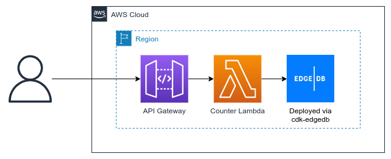

# cdk-edgedb-demo

This CDK app leverages [cdk-edgedb](https://github.com/aaronbrighton/cdk-edgedb) and [cdk-lets-encrypt](https://github.com/aaronbrighton/cdk-lets-encrypt) to provision a HA (high availability) deployment of [EdgeDB](https://www.edgedb.com/) used by a simple serverless demo service/api.

## Architecture

### Demo Service/API



### Underlying EdgeDB Infrastructure (deployed via cdk-edgedb)


### Usage

#### 1. Install dependencies

```
yarn install
npx projen
```

#### 2. Update custom domain properties

Using the details of a Route53 zone in your account, update the following 4 properties in `src/main.ts`:

```
const edgeDB = new edgedb.EdgeDB(this, 'EdgeDB', {
    customDomain: {
        hostedZoneId: 'ZRZJWLXW3FS0K',
        zoneName: 'aaronbrighton.ca',
        name: 'edgedb.aaronbrighton.ca',
        email: 'aaron@aaronbrighton.ca',
    }
});
```

#### 3. Deploying

```
yarn deploy
```

_Note:_ This could take 10-20 minutes as the RDS Aurora PostgreSQL instances are spun up.

Once finished you'll have the following outputs, you'll need them in the next steps:

```
cdk-edgedb-demo.ApiEndpoint = https://w83keja7je.execute-api.us-east-1.amazonaws.com
cdk-edgedb-demo.EdgeDBEndpoint = edgedb.aaronbrighton.ca
cdk-edgedb-demo.EdgeDBPasswordSecert = https://console.aws.amazon.com/secretsmanager/home?region=us-east-1#!/secret?name=EdgeDBEdgeDBServerSecretA33-3JmwVXfMDQ58
```

#### 4. Connecting to your EdgeDB instance with EdgeDB CLI

Using [EdgeDB CLI](https://www.edgedb.com/docs/cli/index), connect to your instance and update the schema to what our demo service expects.

```
mkdir edgedb-instance
cd edgedb-instance
edgedb project init # Use defaults
vim dbschema/default.esdl
```

Replace the contents of `dbschema/default.esdl` with the following:

```
module default {
        type Counter {
                required property count -> int64;
        }
};
```

Apply the new schema using a migration:

```
edgedb project unlink
edgedb instance link # Check out the DSN in the AWS Secrets Manager secret at the link returned in the yarn deploy output to provide the correct values.
edgedb project init --link # Use the name of the instance from the result of the previous command.
edgedb migration create
edgedb migrate
edgedb -I edgedb_aaronbrighton_ca # Replace with the name of the instance from the instance link command.
insert Counter {
    count := 1,
};
\q
```

#### 5. Testing the demo service

Using the `ApiEndpoint` from the `yarn deploy` outputs, send requests to it and watch it retrieve and increment the count stored in EdgeDB:

```
curl https://w83keja7je.execute-api.us-east-1.amazonaws.com
[{"count":2}]%

curl https://w83keja7je.execute-api.us-east-1.amazonaws.com
[{"count":3}]%

curl https://w83keja7je.execute-api.us-east-1.amazonaws.com
[{"count":4}]%
```

#### 6. Tearing it all down

```
yarn destroy
```
